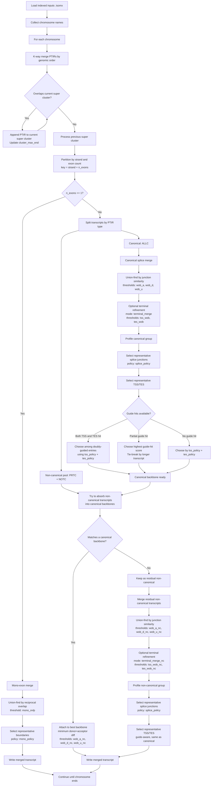

# Merge Flowchart

This diagram summarizes the implemented merge logic in `src/merge`.
It includes only parameters that are actively used by the current merge code path.

## Implemented Merge Parameters

- Guide-aware representative selection:
  - `guide_tss`
  - `guide_tes`
  - `guide_tss_flank`
  - `guide_tes_flank`
  - `chrmap`
- Canonical multi-exon merge:
  - `wob_a`
  - `wob_d`
  - `wob_u`
  - `tss_wob`
  - `tes_wob`
  - `terminal_merge`
- Non-canonical multi-exon merge:
  - `wob_a_nc`
  - `wob_d_nc`
  - `wob_u_nc`
  - `tss_wob_nc`
  - `tes_wob_nc`
  - `terminal_merge_nc`
- Representative selection:
  - `splice_policy`
  - `tss_policy`
  - `tes_policy`
  - `mono_policy`
- Mono-exon merge:
  - `mono_ovlp`

## Explicitly Excluded

These arguments exist in `MergeArgs` but are not currently used by the implemented merge path:

- `sx_max`
- `junc_diff`
- `shift_rescue`
